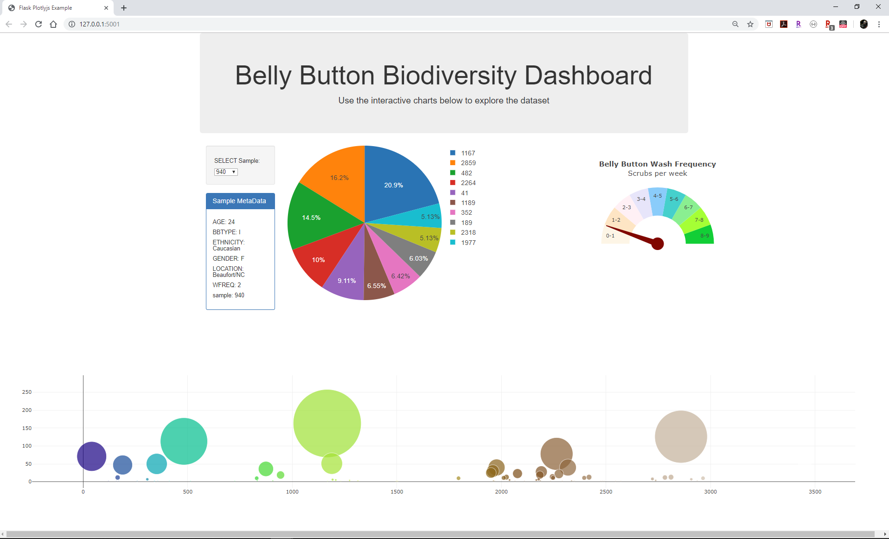

# plotly-challenge
### Dashboard for belly button

#### Aim
Build an interactive dashboard to explore the [Belly Button Biodiversity DataSet](http://robdunnlab.com/projects/belly-button-biodiversity/).
 Plots are generated using [Plotly](https://plot.ly/javascript/)

#### Heroku
The app is deployed on Heroku at: [https://mitsu-belly-button.herokuapp.com/](https://mitsu-belly-button.herokuapp.com/)

#### Dashboard
Example of dashboard for sample #940. 

